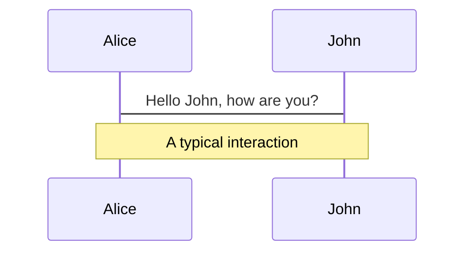
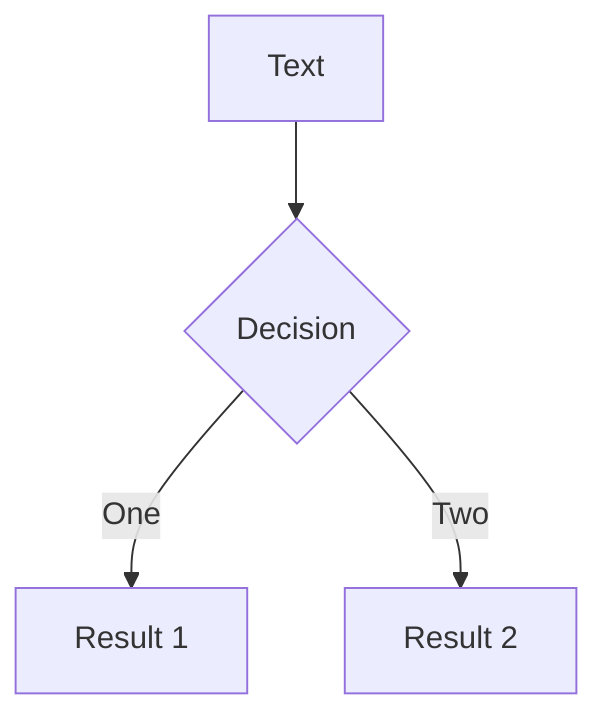

# Welcome to slidev


<div class="pt-5">
  <span @click="$slidev.nav.next" class="px-1 p-1 rounded cursor-pointer" hover="bg-white bg-opacity-10">
    Press Space for next page <carbon:arrow-right class="inline"/>
  </span>
</div>

<a href="https://github.com/slidevjs/slidev" target="_blank" alt="GitHub"
  class="abs-br m-6 text-xl icon-btn opacity-50 !border-none !hover:text-white">
  <carbon-logo-github />
</a>

---

# Introduction

Slidev是为开发人员设计的幻灯片制作和演示工具，是一个对程序员极度友好的演示PPT的方式，可以直接用slidev一个软件搞定排版和代码展示。它有以下几个主要特性：

- 📝 **文本库** - Markdown支持,使用你最喜欢的编辑器和工作流编写Markdown文件
- 🎨 **可定制主题** - 主题以npm包的形式共享、使用
- 🧑‍💻 **开发者友好** - 内置代码高亮，实时编码等功能
- 🤹 **交互** - 无缝嵌入 Vue 组件
- 🎥 **录制** - 内置录音功能和摄像头视图
- 📤 **便捷** - 能够导出PDF，PNG文件，甚至是一个可以托管的单页应用
- 🛠 **可嵌入** - 支持 Vite 插件，Vue 组件或任何 npm 软件包
<br>
<br>


<style>
h1 {
  background-color: #2B90B6;
  background-image: linear-gradient(50deg, #4EC5D4 10%,#146b8c 30%);
  background-size: 100%;
  -webkit-background-clip: text;
  -moz-background-clip: text;
  -webkit-text-fill-color: transparent; 
  -moz-text-fill-color: transparent;
}
</style>

---

# Comparison

Slidev VS Microsoft PowerPoint


（1）slidev可以让你集中在PPT内容制作上而不需要花太多精力在样式调整和校对上，通过分离内容和视觉效果，你仅仅用 Markdown 语法就可以做出一个高颜值幻灯片；  

（2）功能非常齐全，可以用vue自定义动画，样式，主题等； 

（3）移植方便，可以导出成pdf使用，或者导出成一个单页web应用。


<style>
h1 {
  background-color: #2B90B6;
  background-image: linear-gradient(50deg, #4EC5D4 10%,#146b8c 30%);
  background-size: 100%;
  -webkit-background-clip: text;
  -moz-background-clip: text;
  -webkit-text-fill-color: transparent; 
  -moz-text-fill-color: transparent;
}
</style>
---


# 主题

Slidev带有强大的主题支持，能够提供样式、布局、组件甚至工具的配置，只需要在主题中进行**一次编辑**即可切换:

<div grid="~ cols-2 gap-2" m="-t-2">

```yaml
---
theme: default
---
```

```yaml
---
theme: seriph
---
```


</div>

---

# 图标

Slidev允许你在Markdown中直接访问几乎所有的开源的图标种植集


---


# 导航


### 快捷键

|     |     |
| --- | --- |
| <kbd>right</kbd> / <kbd>space</kbd>| 下一个动画或幻灯片 |
| <kbd>left</kbd> | 上一个动画或幻灯片 |
| <kbd>up</kbd> | 上一张幻灯片 |
| <kbd>down</kbd> | 下一张幻灯片 |


<p v-after class="absolute bottom-23 left-45 opacity-50 transform -rotate-9">Here!</p>

---
layout: image-right
image: https://source.unsplash.com/collection/94734566/1920x1080
---

# 代码

使用代码段并直接突出显示!

```ts {all|2|1-6|9|all}
interface User {
  id: number
  firstName: string
  lastName: string
  role: string
}

function updateUser(id: number, update: User) {
  const user = getUser(id)
  const newUser = {...user, ...update}  
  saveUser(id, newUser)
}
```

<arrow v-click="3" x1="300" y1="500"  x2="200" y2="330" color="#564" width="3" arrowSize="1" />

---

# 组件

<div grid="~ cols-2 gap-4">
<div>

可以在幻灯片内部直接使用Vue组件

还有一些内置组件，例如 `<Tweet/>` 和 `<Youtube/>`，可以直接使用，添加自定义组件也很容易

```html
<Counter :count="10" />
```

<!-- ./components/Counter.vue -->
<Counter :count="10" m="t-4" />


</div>
<div>

```html
<Tweet id="1390115482657726468" />
```

<Tweet id="1390115482657726468" scale="0.65" />

</div>
</div>

---
class: px-20
---


# 动画制作

动画由[@vueuse/motion](https://motion.vueuse.org/)驱动.

```html
<div
  v-motion
  :initial="{ x: -80 }"
  :enter="{ x: 0 }">
  Slidev
</div>
```

<div class="w-60 relative mt-6">
  <div class="relative w-40 h-40">
    
    
    
  </div>

  <div 
    class="text-5xl absolute top-10 left-40 text-[#2B90B6] -z-1"
    v-motion
    :initial="{ x: -80, opacity: 0}"
    :enter="{ x: 0, opacity: 1, transition: { delay: 2000, duration: 1000 } }">
    幻灯片
  </div>
</div>

<!-- vue script setup scripts can be directly used in markdown, and will only affects current page -->
<script setup lang="ts">
const final = {
  x: 0,
  y: 0,
  rotate: 0,
  scale: 1,
  transition: {
    type: 'spring',
    damping: 10,
    stiffness: 20,
    mass: 2
  }
}
</script>

<div
  v-motion
  :initial="{ x:35, y: 40, opacity: 0}"
  :enter="{ y: 0, opacity: 1, transition: { delay: 3500 } }">

[演示]

</div>

---

# LaTeX

LaTeX is supported out-of-box powered by [KaTeX](https://katex.org/).

<br>

Inline $\sqrt{3x-1}+(1+x)^2$

Block
$$
\begin{array}{c}

\nabla \times \vec{\mathbf{B}} -\, \frac1c\, \frac{\partial\vec{\mathbf{E}}}{\partial t} &
= \frac{4\pi}{c}\vec{\mathbf{j}}    \nabla \cdot \vec{\mathbf{E}} & = 4 \pi \rho \\

\nabla \times \vec{\mathbf{E}}\, +\, \frac1c\, \frac{\partial\vec{\mathbf{B}}}{\partial t} & = \vec{\mathbf{0}} \\

\nabla \cdot \vec{\mathbf{B}} & = 0

\end{array}
$$

<br>

[Learn more](https://sli.dev/guide/syntax#latex)

---

# 图表

可以根据文本描述，直接在Markdown里创建图表

<div class="grid grid-cols-2 gap-4 pt-4 -mb-6">





</div>

[Learn More](https://sli.dev/guide/syntax.html#diagrams)


---
layout: center
class: text-center
---

# Learn More

[Documentations](https://sli.dev) / [GitHub Repo](https://github.com/slidevjs/slidev)
